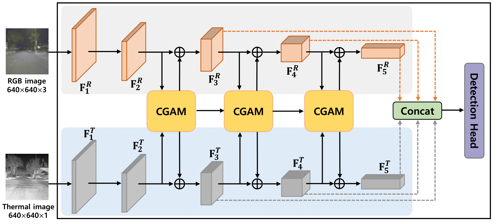
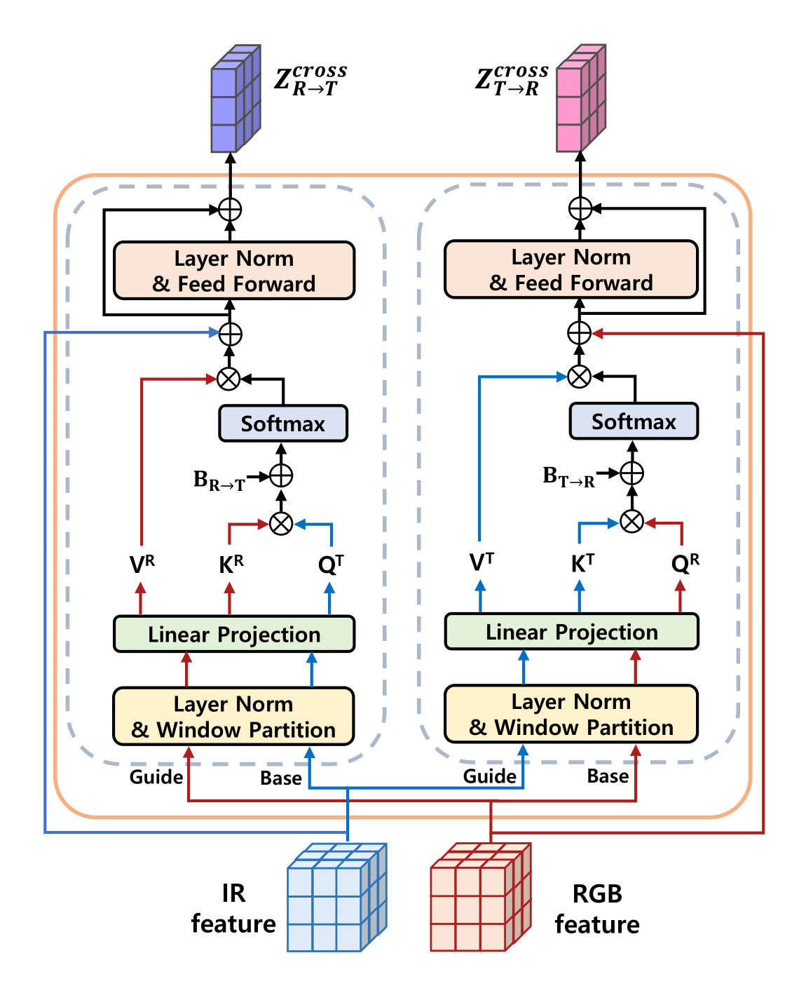

<!-- Using HTML to center the abstract -->
<div class="columns is-centered has-text-centered">
    <div class="column is-four-fifths">
        <h2>Abstract</h2>
        <div class="content has-text-justified">
<!-- The "computable" numbers may be described briefly as the real
numbers whose expressions as a decimal are calculable by finite means.
Although the subject of this paper is ostensibly the computable numbers.
it is almost equally easy to define and investigate computable functions
of an integral variable or a real or computable variable, computable
predicates, and so forth. The fundamental problems involved are,
however, the same in each case, and I have chosen the computable numbers
for explicit treatment as involving the least cumbrous technique. I hope
shortly to give an account of the relations of the computable numbers,
functions, and so forth to one another. This will include a development
of the theory of functions of a real variable expressed in terms of computable
numbers. According to my definition, a number is computable
if its decimal can be written down by a machine... -->
Object detection is one of the essential tasks in a variety of real-world applications such as autonomous driving and robotics. In a real-world scenario, unfortunately, there are numerous challenges such as illumination changes, adverse weather conditions, and geographical changes, to name a few. To tackle the problem, we propose a novel multi-modal object detection model that is built upon a hierarchical transformer and cross-guidance between different modalities. The proposed hierarchical transformer consists of domain-specific feature extraction networks where intermediate features are connected by the proposed Cross-Guided Attention Module (CGAM) to enrich their representational power. Specifically, in the CGAM, one domain is regarded as a guide and the other is assigned to a base. After that, the cross-modal attention from the guide to the base is applied to the base feature. The CGAM works bidirectionally in parallel by exchanging roles between modalities to refine multi-modal features simultaneously. Experimental results on FLIR-aligned, LLVIP, and KAIST multispectral pedestrian datasets demonstrate that the proposed method is superior to previous multi-modal detection algorithms quantitatively and qualitatively.
        </div>
    </div>
</div>

---

<!-- > Note: This is an example of a Jekyll-based project website template: [Github link](https://github.com/shunzh/project_website).\
> The following content is generated by ChatGPT. The figure is manually added. -->

## Background
<!-- The paper "On Computable Numbers, with an Application to the Entscheidungsproblem" was published by Alan Turing in 1936. In this groundbreaking paper, Turing introduced the concept of a universal computing machine, now known as the Turing machine. -->
The paper "CrossFormer : Cross-guided attention for multi-modal object detection" was published by Seungik Lee in 2024. In this groundbreaking paper, Seungik introduced the concept of Cross-Guided Attention Module(CGAM) based RGB-IR domain.

## Objective
Seungik's main objective in this paper was to propose a novel cross-guided attention
mechanism for robust multi-modal object detection in changing environments. Our model is designed to help RGB and IR modalities interact effectively by generating the query and key, value from the base and guide domains, respectively. This cross-modal key-query interaction facilitates information exchange between different domains. Moreover, we have introduced a hierarchical structure that is effective in providing multi-scale object detection cues.

## Key Ideas
1. A novel cross-guided attention mechanism is proposed to enhance multi-modal features using attention maps generated by complementary interactions between modalities.
2. Multi-scale attention maps are generated to detect objects of various sizes by the proposed hierarchical transformer.
3. The proposed model has achieved state-of-the-art performance in FLIR-aligned, LLVIP, and KAIST multispectral pedestrian datasets.



*Figure 1: Overall architecture of the proposed model.



*Figure 2:  Cross-guided attention mechanism of the proposed CGAM.

## Table: Object detection performance and computational complexity comparison on FLIRaligned and LLVIP datasets.

<!-- | Computable Numbers | Non-Computable Numbers |
|-------------------|-----------------------|
| Rational numbers, e.g., 1/2, 3/4 | Transcendental numbers, e.g., π, e |
| Algebraic numbers, e.g., √2, ∛3 | Non-algebraic numbers, e.g., √2 + √3 |
| Numbers with finite decimal representations | Numbers with infinite, non-repeating decimal representations | -->

|   Dataset   | Modality |       Mehod        | mAP50 | mAP75 | mAP  | GFLOPs |
|FLIR-aligned |    RGB   |       YOLOv5       | 67.8  | 25.9  | 31.8 | 115.58 |
|FLIR-aligned |    IR    |       YOLOv5       | 73.9  | 35.7  | 39.5 | 115.58 |
|FLIR-aligned |  RGB+IR  | Two-stream YOLOv5  | 73.0  | 32.0  | 39.5 | 190.14 |
|FLIR-aligned |  RGB+IR  | CFR_3              | 72.4  | 32.9  | 37.5 | 190.14 |    |
|FLIR-aligned |  RGB+IR  | GAFF(ResNet18)     | 72.9  | 32.9  | 37.5 |  -     |
|FLIR-aligned |  RGB+IR  | GAFF(VGG16)        | 72.7  | 30.9  | 37.3 |  -     |
|FLIR-aligned |  RGB+IR  | CFT                | 78.7  | 35.5  | 40.2 | 200.40 |
|FLIR-aligned |  RGB+IR  | CrossFormer        | 79.3  | 38.5  | 42.1 | 361.66 |
|    LLVIP    |    RGB   |       YOLOv5       | 90.8  | 51.9  | 50.0 | 115.58 |
|    LLVIP    |    IR    |       YOLOv5       | 94.6  | 72.2  | 61.9 | 115.58 |
|    LLVIP    |  RGB+IR  | Two-stream YOLOv5  | 95.8  | 71.4  | 62.3 |  37.3  |
|    LLVIP    |  RGB+IR  | CFT                | 97.5  | 72.9  | 63.6 | 200.40 |
|    LLVIP    |  RGB+IR  | CrossFormer        | 79.4  | 75.4  | 65.1 | 361.66 |


<!-- He used the concept of a universal Turing machine to prove that the set of computable functions is recursively enumerable, meaning it can be listed by an algorithm. -->

<!-- ## Significance
Turing's paper laid the foundation for the theory of computation and had a profound impact on the development of computer science. The Turing machine became a fundamental concept in theoretical computer science, serving as a theoretical model for studying the limits and capabilities of computation. Turing's work also influenced the development of programming languages, algorithms, and the design of modern computers. -->

## Citation
```
@article{lee2024crossformer,
  title={CrossFormer: Cross-guided attention for multi-modal object detection},
  author={Lee, Seungik and Park, Jaehyeong and Park, Jinsun},
  journal={Pattern Recognition Letters},
  year={2024},
  publisher={Elsevier}
}
```
